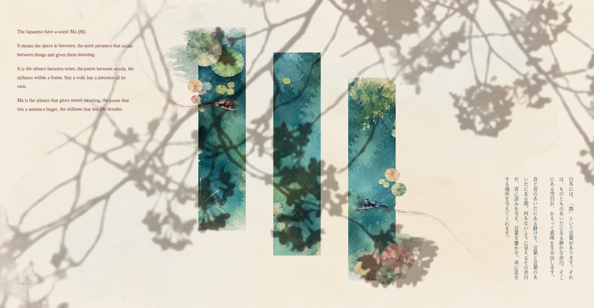

# Ma — The Space Between Things

An interactive web essay about *ma* (間), the Japanese idea of purposeful empty space, built as three watercolor koi ponds sunk into a paper page. Two koi swim continuously between them through a live water simulation, diving under the paper at one pond's edge and resurfacing at the next.

## Overview

- **Water** — real-time WebGL ripple shader that reacts to the koi moving through it and to clicks
- **Koi** — a segmented spine driven by a wander/steering behavior, with hand-painted koi art mesh-warped onto it frame by frame so the body bends like a real fish
- **Tunnel crossings** — koi dissolve into the paper at a pond's edge and resurface in another pond through a shared underground path, rather than swimming off-canvas
- **Shadow** — a sakura branch swaying overhead with cursor parallax, also sampled into the water shader so its shadow ripples wherever it crosses a pond

Single-file web app. No build step, no backend.

## Running locally

Open `index.html` in a modern browser (Chrome, Safari, Firefox, Edge). Click anywhere in a pond to drop food — the koi will notice and swim over to eat it.

## Features

- Two independently animated koi with mesh-warped body undulation
- Click-to-feed interaction
- Live WebGL water ripple simulation, including the sakura shadow rippling across it
- Text that gently makes way for each koi's trailing wake as it swims past
- Responsive scaling that keeps the whole layout intact from small windows up to ultra-wide monitors
- Looping ambient audio with a mute toggle

## Stack

- Vanilla JS / CSS, no framework
- Canvas 2D for the koi and mesh-warping, custom WebGL shader for the water
- All imagery and audio generated in Gemini, composited by hand
